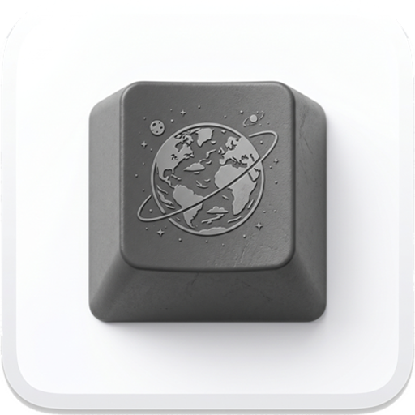
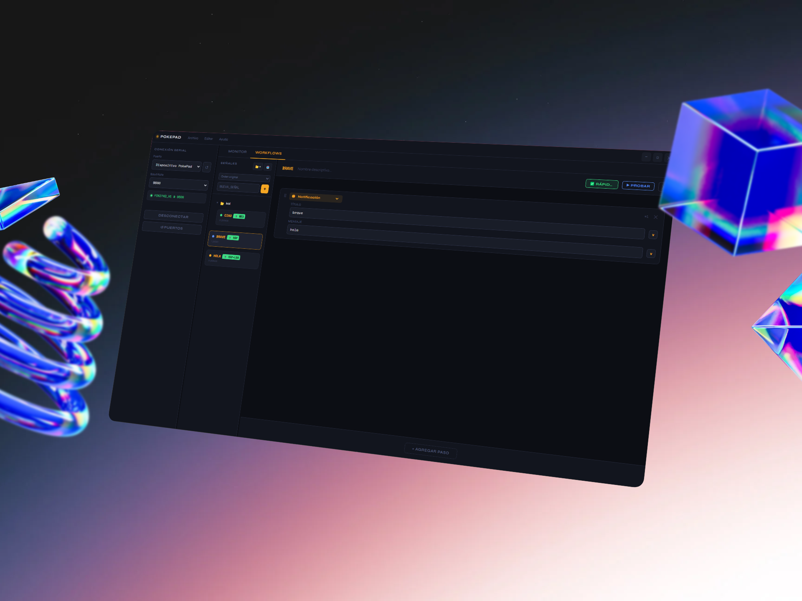
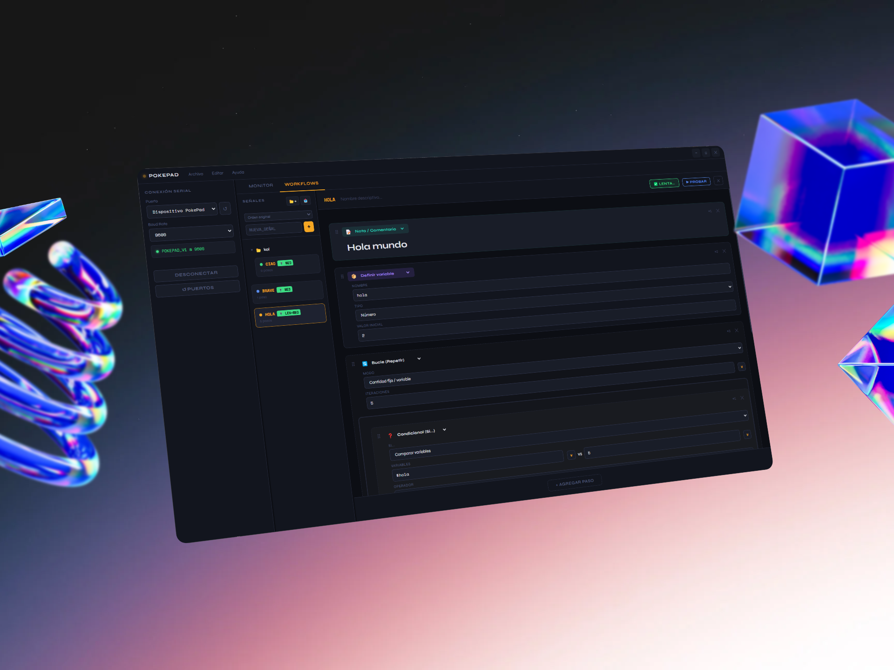

<div align="center">
  
  <h1>PokePad</h1>
  <p>App para capturar señales seriales de un Macroball y ejecutar acciones configurables.</p>
  <p>Creado por Programadores, Para Programadores</p>
</div>

<div align="center">
  
</div>

<div align="center">
  
</div>

---

## Instalación

```bash
npm install
npm start
```

> Primera vez tarda un poco porque Electron descarga los binarios de `serialport`.

## Uso

1. **Conectar** → seleccioná el puerto (ej: COM3 en Windows, /dev/ttyUSB0 en Linux) y el baud rate (default 9600).
2. **Agregar señal** → clic en "+ AGREGAR", escribí la señal que manda tu Arduino (ej: `BUTTON_1`) y elegí qué hace.
3. **Listo** → cada vez que el Arduino envíe esa señal, la acción se ejecuta automáticamente.

## Tipos de acción (Bloques de Workflow)

### Entrada y sistema

| Bloque | Icono | Descripción | Parámetros |
| ------ | ----- | ----------- | ---------- |
| **Simular tecla** | ⌨ | Simula una combinación de teclas | `combo`: combinación (ej: `ctrl+c`, `win+d`) |
| **Esperar** | ◷ | Pausa la ejecución | `ms`: milisegundos a esperar |
| **Copiar texto** | ⎘ | Escribe texto en el portapapeles | `text`: texto a copiar (soporta variables) |
| **Media** | ▶ | Controla la reproducción multimedia | `action`: `play_pause` / `next` / `prev` / `vol_up` / `vol_down` / `mute` |

### Lanzar y ejecutar

| Bloque | Icono | Descripción | Parámetros |
| ------ | ----- | ----------- | ---------- |
| **Abrir URL** | ↗ | Abre una URL en el navegador predeterminado | `url`: dirección web (ej: `https://youtube.com`) |
| **Ejecutar cmd** | $ | Ejecuta un comando del sistema | `cmd`: comando (ej: `notepad.exe`) |
| **Abrir archivo** | ⌂ | Abre un archivo con su aplicación predeterminada | `path`: ruta al archivo |
| **Abrir aplicación** | 🚀 | Lanza una aplicación por su ruta | `path`: ruta al ejecutable o app |
| **Ejecutar script** | `{ }` | Ejecuta código Python o JavaScript | `lang`: `python` / `javascript` · `code`: código a ejecutar |

### Variables

| Bloque | Icono | Descripción | Parámetros |
| ------ | ----- | ----------- | ---------- |
| **Definir variable** | 📦 | Crea o sobreescribe una variable | `name`: nombre · `value`: valor · `type`: `string` / `int` / `list` |
| **Modificar variable** | ⚙ | Opera sobre una variable existente | `name`: nombre · `op`: `add` / `sub` / `set` / `concat` · `value`: valor |
| **Operación de lista** | ▤ | Modifica una variable de tipo lista | `name`: nombre · `op`: `append` / `pop` / `clear` / `remove_at` · `value`: valor |

### Control de flujo

| Bloque | Icono | Descripción | Parámetros |
| ------ | ----- | ----------- | ---------- |
| **Bucle (Repetir)** | 🔄 | Repite un conjunto de pasos | Modo `fixed`: `iterations` (número) · Modo `foreach`: `list_name` + `var_name` |
| **Condicional (Si...)** | ❓ | Ejecuta pasos según una condición | `type`: `prev_step_success` / `clipboard_match` / `app_running` / `var_cmp` |

Tipos de condición disponibles para el bloque **Condicional**:

| Condición | Descripción |
| --------- | ----------- |
| `prev_step_success` | ¿El paso anterior se ejecutó sin errores? |
| `clipboard_match` | ¿El portapapeles contiene el texto indicado? |
| `app_running` | ¿Una aplicación determinada está abierta? |
| `var_cmp` | Compara dos variables (`==`, `!=`, `>`, `<`, `contains`) |

### Interfaz y utilidades

| Bloque | Icono | Descripción | Parámetros |
| ------ | ----- | ----------- | ---------- |
| **Notificación** | ◉ | Muestra una notificación del sistema | `title`: título · `body`: mensaje |
| **Captura de pantalla** | 📸 | Captura toda la pantalla como PNG | `filename`: nombre del archivo (opcional) |
| **Captura de región** | ✂️ | Captura una región seleccionada interactivamente | `filename`: nombre del archivo (opcional) |
| **Nota / Comentario** | 📝 | Texto informativo sin efecto en la ejecución | _(sin parámetros)_ |

> Las capturas se guardan en `~/Pictures/MacroPad/`. Los parámetros de tipo texto soportan interpolación de variables con `$nombre_variable`.

## Arduino

El sketch tiene que enviar strings por `Serial.println()`. Esas strings son las "señales":

```cpp
Serial.begin(9600);

// En loop():
if (buttonPressed) {
  Serial.println("MI_SEÑAL");  // ← esto va en la app
}
```

La señal debe coincidir **exactamente** (case sensitive).

## Temas

PokePad soporta temas personalizados. Los temas se definen como archivos `.json` en la carpeta `assets/themes/`. Vienen incluidos `dark-default.json` y `light-default.json`.

Para crear un tema propio:

1. Copiá `assets/themes/template-example.json` con un nombre nuevo (ej: `mi-tema.json`).
2. Modificá los campos `id`, `name`, `type` (`dark` o `light`) y los colores.
3. Reiniciá PokePad o abrí la configuración para aplicarlo.

Variables de color principales:

| Variable    | Descripción                          |
| ----------- | ------------------------------------ |
| `--bg`      | Color de fondo principal             |
| `--surface` | Color de tarjetas y paneles          |
| `--text`    | Color del texto principal            |
| `--amber`   | Color de acento (botones y activos)  |
| `--border`  | Color de los bordes sutiles          |

## Empaquetar como ejecutable

```bash
npm install electron-builder --save-dev
npm run build
```

Genera el instalador en la carpeta `dist/`.

## Agregar nuevos bloques a los Workflows

Para agregar un nuevo tipo de bloque (paso) que se pueda usar en los flujos de trabajo, seguí estos pasos:

### 1. Definir el tipo en el Frontend

En `renderer/js/state.js`, agregá el nuevo tipo al objeto `STEP_TYPES`:

```javascript
export const STEP_TYPES = {
  // ... existentes
  mi_nuevo_bloque: { 
    label: "Nombre para mostrar", 
    icon: "🚀", 
    cls: "t-mi-clase-css" 
  },
};
```

### 2. Crear la interfaz del bloque

En `renderer/js/workflows.js`, dentro de la función `buildStepParams(container, step, path)`, agregá un nuevo `case` para tu tipo:

```javascript
case "mi_nuevo_bloque": {
  const row = makeRow("Configuración del bloque");
  const wrap = document.createElement("div"); wrap.className = "param-input-row";
  
  // Usá makeInput para que el valor se guarde automáticamente en params.mi_parametro
  const inp = makeInput("text", p.mi_parametro || "", "placeholder...", "mi_parametro");
  inp.className = "param-input flex-1";
  
  wrap.appendChild(inp);
  wrap.appendChild(makeVarLink("mi_parametro")); // Permitir usar variables
  row.appendChild(wrap);
  container.appendChild(row);
  break;
}
```

### 3. Implementar la ejecución en el Backend

En `main-process/execution.js`, dentro de la función `executeStep(step, context)`, agregá la lógica de ejecución:

```javascript
case "mi_nuevo_bloque": {
  // Obtené los parámetros (se resuelven automáticamente si usás resolveValue)
  const miValor = resolveValue(p.mi_parametro, context);
  
  // Tu lógica de ejecución aquí (debe ser async)
  await miFuncionDeEjecucion(miValor);
  break;
}
```

### 4. Estilos (Opcional)

Si definiste una clase CSS en el paso 1 (ej: `t-mi-clase-css`), podés agregar estilos para el borde o el icono en `renderer/css/workflows.css`.

---

## Agregar nuevos tipos de acción (Legado)

Esta sección aplica a la lógica antigua. Para el sistema de Workflows actual, seguí los pasos de la sección anterior.

## Agregar nuevas Pestañas y Ventanas

La aplicación utiliza un sistema modular para su interfaz. Todo el HTML de los componentes se carga dinámicamente desde `renderer/views/` y la lógica reside en `renderer/js/`.

### 1. Crear una nueva Pestaña (Tab)

1. **Crear la vista HTML**: Crea un nuevo archivo en `renderer/views/mi-pestana.html` con el contenido.
2. **Modificar `index.html`**:
   - Agregá el botón en la barra de pestañas (dentro de `<div class="tabs">`):
     ```html
     <div class="tab" onclick="switchTab('mi_pestana', this)">Mi Pestaña</div>
     ```
   - Agregá el contenedor vacío donde se inyectará tu vista:
     ```html
     <div class="tab-pane" id="tab-mi_pestana"></div>
     ```
3. **Cargar la vista en `js/main.js`**:
   Dentro del evento `DOMContentLoaded`, agregá la carga asíncrona:
   ```javascript
   await loadView("tab-mi_pestana", "views/mi-pestana.html");
   ```
4. **Agregar lógica**: Crea un archivo `js/mi-pestana.js` con tus funciones. Si vas a usar eventos `onclick` o `oninput` directamente en tu HTML, asegurate de exponer esas funciones globalmente al final del archivo (ej. `window.miFuncion = miFuncion`). Importalo luego en `main.js`.

### 2. Crear Ventanas o Modales

1. **Crear la vista HTML**: Diseñá el modal en `renderer/views/mi-modal.html`. Podés usar la clase `.cmd-modal-overlay` de base y ocultarlo por defecto (`style="display: none;"`).
2. **Agregar el contenedor en `index.html`**:
   Al final del body, junto al otro modal:
   ```html
   <div id="mi-modal-container"></div>
   ```
3. **Cargarlo en `js/main.js`**:
   ```javascript
   await loadView("mi-modal-container", "views/mi-modal.html");
   ```
4. **Mostrar y ocultar**: Agregá funciones en tu lógica (ej. en `ui.js`) que hagan `document.getElementById('id_del_overlay_del_modal').style.display = 'flex'` para mostrarlo, o `'none'` para cerrarlo.

### 3. Agregar Menús y Submenús

La barra de título contiene un menú personalizado. Podés agregar nuevos menús o submenús siguiendo esta estructura en `index.html`:

#### Agregar un Menú Principal

Agregá un bloque `.menu-wrapper` dentro de `<div class="tb-menu">`:
```html
<div class="menu-wrapper">
  <div class="menu-btn">Nuevo Menú</div>
  <div class="dropdown">
    <div class="dd-item" id="menu-accion-1">Acción 1</div>
    <div class="dd-divider"></div>
    <div class="dd-item" id="menu-accion-2">Acción 2</div>
  </div>
</div>
```

#### Agregar un Submenú

Para que un item tenga un submenú, agregá la clase `.has-submenu` al `.dd-item` e inyectá un `.dd-submenu` dentro:
```html
<div class="dd-item has-submenu">
  Más Opciones
  <div class="dd-submenu">
    <div class="dd-item" id="sub-1">Sub Opción A</div>
    <div class="dd-item" id="sub-2">Sub Opción B</div>
  </div>
</div>
```

#### Manejar clics

En `js/main.js` o un módulo dedicado, agregá el listener usando el ID que definiste:
```javascript
document.getElementById('menu-accion-1').addEventListener('click', () => {
  console.log("Acción ejecutada");
});
```
